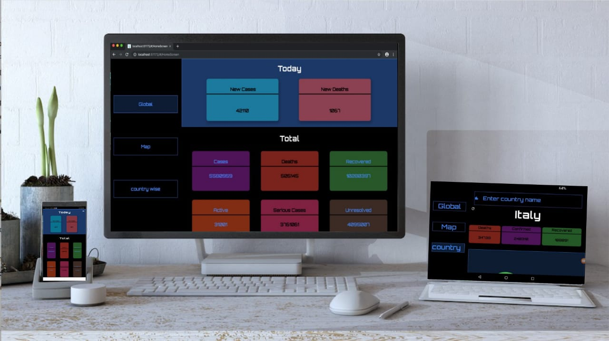

# Hack20

**This project was the implementation of an automated system to get live COVID-19 updates.**

**This project was the implementation of an automated system to get live COVID-19 updates. We implemented different charts, maps, graphs to help understand the data quickly. We provide global, country wise and area specific datas. We created this with a futuristic UI.We made this responsive to multiple platforms such as Tablet, Web as well as Mobile.**
